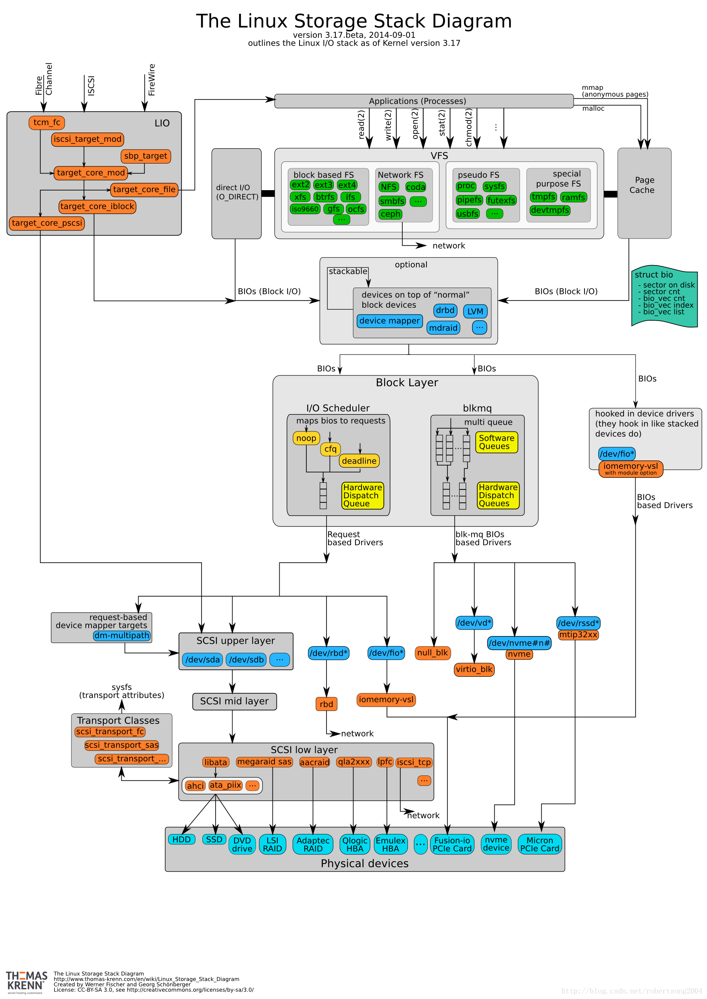

# Linux 块设备IO架构

Linux中大部分外设都属于两个类别：字符设备和块设备，而用于文件系统的主要是块设备。

块设备的基本特征是将设备视为一个平坦的块数组，数据按块传输，可以随机读写。与字符设备不同，块设备往往对IO性能有非常高的要求，因此Linux系统的块设备IO架构非常复杂，采用了许多提高性能的策略来使得IO速度尽可能地快。

Linux的块设备IO架构图如下：

简单来说，从上到下依次为：VFS层，文件系统实现层，块设备抽象层和设备驱动层。

## VFS层

VFS是Linux提供的对文件系统的抽象，它用于屏蔽各种文件系统的实现细节，为应用程序提供一致的文件访问接口。

## 文件系统实现层

文件系统实现层包含了各种各样的文件系统实现，除了少数用于特殊用途的文件系统，几乎所有文件系统的功能都是管理数据块。即在块设备层提供的“平坦的数据块数组”的抽象之上，实现各种各样的数据结构和算法，实现对这个“平坦的数据块数组”的高效利用。

## 块设备抽象层

块设备抽象层是对各种各样的硬件设备的抽象，它负责屏蔽各种设备（例如机械硬盘和固态硬盘）的具体细节，为文件系统实现层提供“平坦的数据块数组”的抽象。块设备需要负责创建和管理IO队列，并将文件系统中的文件读写等操作转换为格式统一的IO请求放到IO队列中。它还会对这些IO请求进行调度以达到最佳的性能。通过IO队列，块设备抽象层可以与设备驱动进行交互。

## 设备驱动层

设备驱动层负责直接与硬件设备进行通信，它们会从块设备抽象层的IO队列中取出IO请求，将这些IO请求转换为硬件设备可处理的命令，然后通过总线/网络等传输方式发送给硬件设备，并在硬件设备处理完成后将结果告知给块设备层。